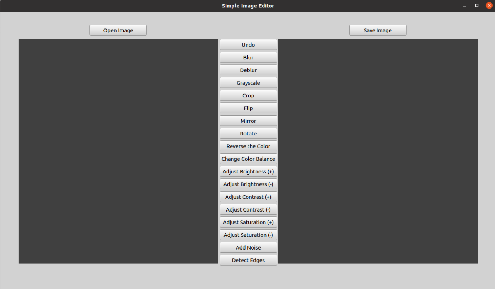

# Simple-Image-Editor

## Overview
Our approach to the simple image editor project is to develop a program that is consistent, safe to work and easy to understand, fast and efficient, and that has a very simple user interface that focuses on the images. The program is divided into two parts: graphical user interface (GUI) and logic that consists of filtering functions. 

### Libraries
* GUI -> PyQt5, Pillow, os
* Filter Functions -> Pillow, Scipy, Skimage, NumPy, opencv(headless)

You have to install requirements.txt using following command:  
`
pip install -r requirements.txt  
`

Then you should run the program using following command:  
`
python3 main.py 
`

## Filter Functions
### 1. Open Image  
It opens an image as PIL.Image object given image path as a parameter.
### 2. Save Image  
It saves an image .jpg format given PIL.Image object.
### 3. Blur
Blur function takes an image as a parameter and applies gaussian blur with radius 1. 
###  Deblur
Deblur function takes an image as a parameter and applies a laplacian filter to the image. It returns a deblurred image.
###  4. Grayscale
It converts the image to grayscale.
###  5. Crop
Given the image and top-left and bottom-right points of the image as parameters, returns the cropped image. Checks for invalid values and ensures the points do not overflow the image size.
###  6. Flip
It takes an image as a parameter and it flips the image around the horizontal axis. 
###  7. Mirror
It mirrors the image.
###  8. Rotate
It rotates the image 90 degrees counterclockwise.
###  9. Invert
It inverts the color of the image.
###  10. Change Color Balance
Color balance algorithm is applied. https://web.stanford.edu/~sujason/ColorBalancing/simplestcb.html
###  11. Adjust Brightness
###   12. Adjust Contrast
###  13. Adjust Saturation
###  14.  Add Noise
Given an image, noise mode and the related noise factor (var or amount), returns the noise added image.
Type of noises to add:  
* "gaussian" Gaussian-distributed additive noise.  
* "poisson" Poisson-distributed noise generated from the data.  
* "salt" Replaces random pixels with 1.  
* "pepper" Replaces random pixels with 0 (for unsigned images) or -1 (for signed images).  
* "s&p" Replaces random pixels with either 1 or low_val, where low_val is 0 for unsigned images or -1 for signed images.  
* "speckle" Multiplicative noise using out = image + n*image, where n is Gaussian noise with specified mean & variance
###   15. Detect Edges
It detects the edges using Canny Algorithm.

## Note
You can undo 1 change.
## Example Images

